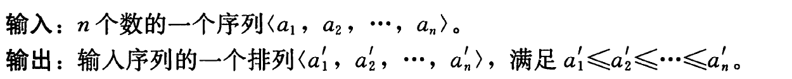
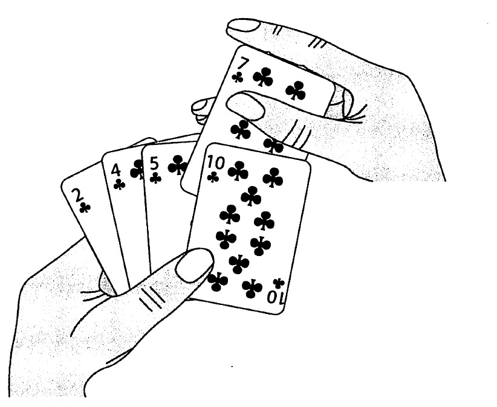

## 插入排序

**问题描述**

  

**开始时，我们的左手为空，并且桌子上的牌面向下，然后，每次从桌子上拿走一张牌，并将它插入左手中正确的位置**
  

**实现方式**
```
INSERTION-SORT(A)
    for j = 2 to A.length
        key = A[j]
        i = j - 1
        while i > 0 and A[i] > key
            A[i + 1] = A[i]
            i--;
        A[i + 1] = key;

```
